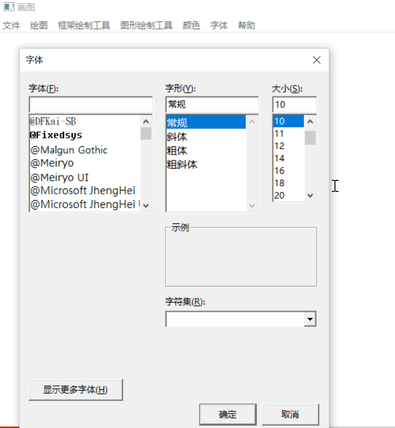
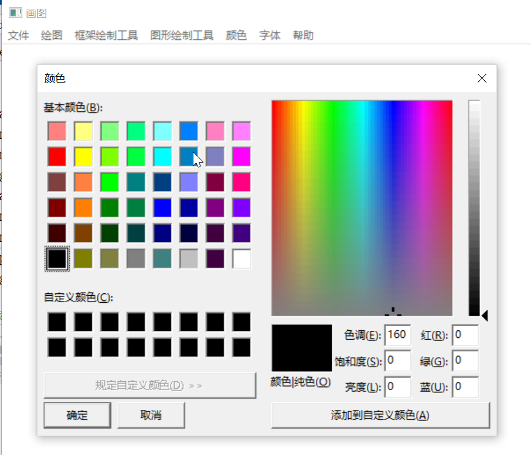

## PictureEditor

汇编与编译原理大作业

时间：2019年11月3日

- 说明文档，要求至少包括开发环境，实现原理，难点和创新点，小组分工等，

可以添加一些程序运行时的截图用以辅助说明。整体篇幅不宜过长，建议在8页以内

### 1. 开发环境

#### windows10下VS2017+masm32

+ 常规 > windows SDK版本：**10.0.17134.0**

+ 常规 > 平台工具集：**Visual Studio 2017 (V141)**

+ 链接器> 附加库目录：**~/masm32/bin;**

  链接器 > 系统 > 子系统：	**窗口(/SUBSYSTEM:WINDOWS)**

+ Microsoft  Macro Assemble > General > **~/masm32/include;**

### 2.实现原理

+ 创建窗口

+ 框架画图

  + 实现了直线、矩形、三角形（分上下）、多边形
  + 直线可调整类型，PS_SOLID(实线), PS_DASH(段线),PS_DOT(点线), PS_DASHDOT(线、点),.... 等共6种
  + 直线可调整粗细，调用GetDlgItemInt函数输入直线粗细值，调整粗细
  + 直线可调整颜色，通过选择颜色可修改PenColor，创建hPen时
  + 矩形，确定两个点以对角的两点，画出四条直线
  + 三角形，原理同矩形
  + 多边形：

  截图

+ 图形

  + 实现了矩形、三角形、多边形、椭圆
  + 其外边距默认借用前面框架直线的设置
  + 内部填充可选颜色
  + 内部填充可选类型，有实心，(斜)交叉，左右斜线，竖/平线
  + 

+ 文本

  + 调用IDialogBoxParam创建输入文本窗口，获取文本

  > Todo:  

  + 字体 IHandleFont函数实现

  >  1. 定义全局变量CurrentFont，为HFONT句柄，存储当前的字体；
  >  2. 使用ChooseFont函数调用字体选择对话框，将选择的字体存入句柄；
  >  3. 当进行文本构建时，直接将CurrentFont作为句柄选择（SelectObject）进入当前HDC(ps.hdc)；
  >  4. CurrentFont作为全局句柄变量无需Delete。

  + 截图：

  

+ 颜色

  + 颜色：IHandleColor函数实现，
  > 1. 存在两种颜色，PenColora和BrushColor，分别作为全局DWORD存储。
  > 2. 使用ChooseColor调用颜色选择对话框，将对应的颜色存入
  > 3. 当需要绘制时，通过CreatePen或者CreateSolidBrush/CreateHatchBrush创建对应的hPen或者hBrush句柄。SelectObject选择进入当前HDC(ps.hdc)
  > 4. 当前创造的句柄需要Delete(DeleteObject)。
  
  + 颜色截图
  
  

### 3. 难点和创新点

+ 选择颜色后如何赋给直线以及填充区域？

> 这需要对于handle句柄以及DC设备上下文有一定的了解
>
> 在绘图时，需要传输DC的句柄hDc至绘图函数中，这样绘图才会成功呈现在当前设备上
>
> 于是，hDc添加多个可选内容，如Brush, Pen, Erase, Bitmap等，以此来调整画图的模式
>
> 对于直线来说，Pen可以通过CreatePen创造；
>
> 对于填充区来说，Brush通过调用CreateSolidBrush/CreateHatchBrush创造
>
> ```assembly
> invoke CreatePen, PenStyle, PenWidth, PenColor ;返回句柄hPen到eax
> invoke CreateSolidBrush, BrushColor
> invoke CreateHatchBrush, HatchStyle, BrushColor;返回句柄hBrush到eax
> ```
>
> 接着，我们将句柄传入到hDc当中即可
>
> ```assembly
> invoke SelectObject, hDc, eax ;此时eax存储在对应的句柄，若想传入多个对象到DC,则需重复多次。
> ```
>
> 最终，通过传输hdc到画图函数中，会自动进行颜色等的改变
>
> ```assembly
> invoke DeleteObject,hPen;此外，必须Delete掉新创造的句柄，否则会出现一些奇怪的错误 
> ```

### 4. 小组分工

#### 1. 沈冠霖：

1. 基本框架

2. 基本的上方菜单

3. 能画线，擦除，绘制基本图形，绘制文字

4. 修改光标

#### 2. 张小健：

1. 实现选择字体，文字大小，字体，（暂无颜色）。
2. 选择颜色：填充颜色和线条颜色
3. 选择填充模式：实心等多种模式
4. 设置线条宽度，线条类型

#### 3. 邓坤恬

1. 文件的保存
2. 文件的读取


代码结构：
Define.inc --常量和各种函数定义

main.asm --窗口主程序

Painter.asm --各种绘图程序

MenuAndControl.asm --菜单和控制部分，需要补全

FileManager.asm --文件处理，还没写呢

WindowsManager.asm --各种事件处理，可能需要微调

Resource.rc--资源文件，资源本身放到res文件夹里


参考：https://github.com/nero19960329/DrawingTool/blob/master/Main.asm  --这个是最简单的demo

https://github.com/youkaichao/AsmPainter  --游神大作业，完成度较高
